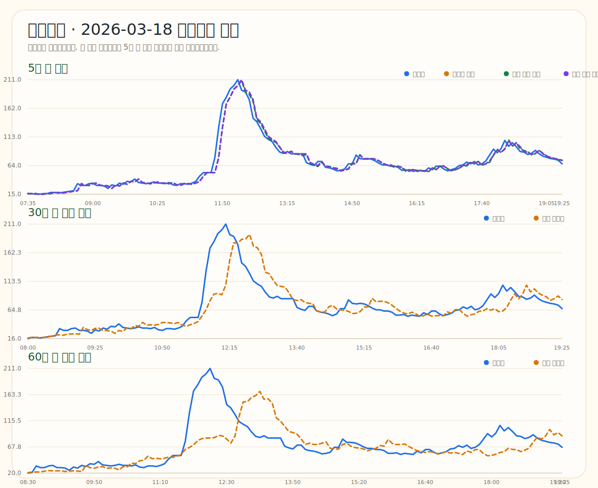
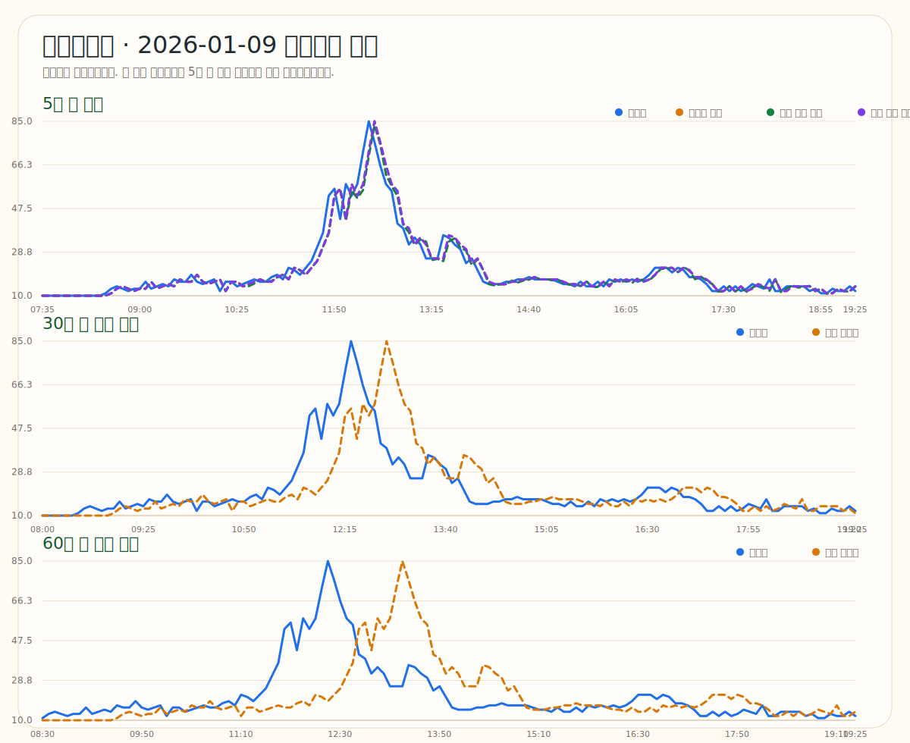
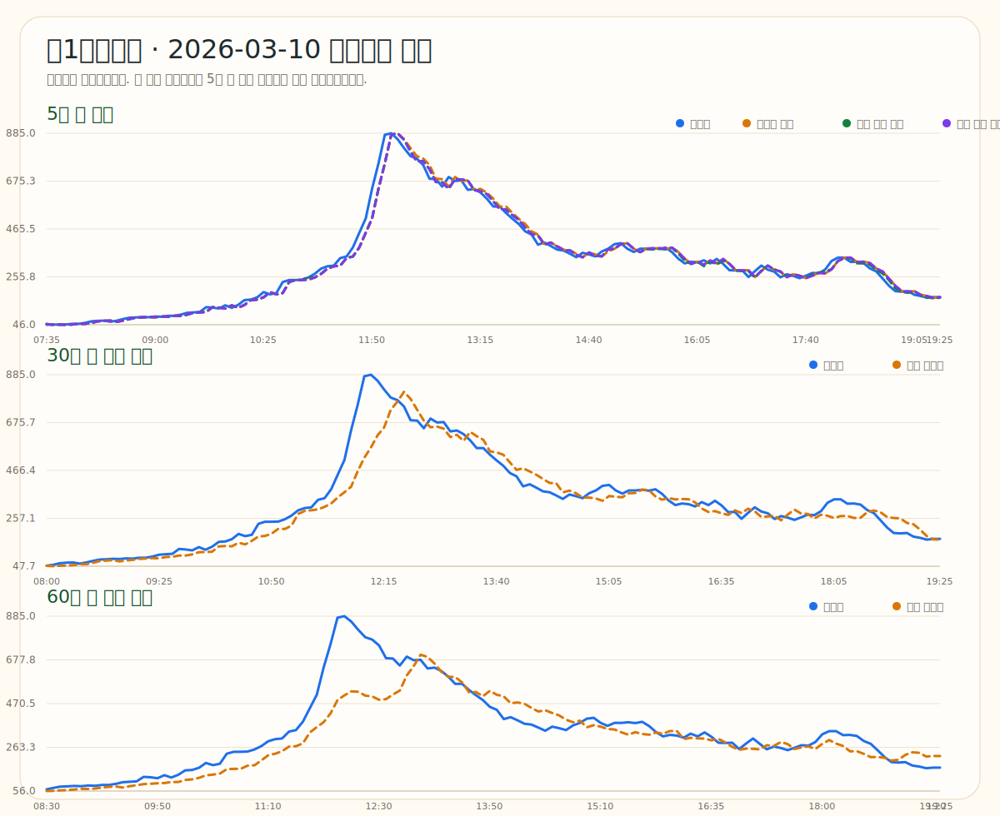
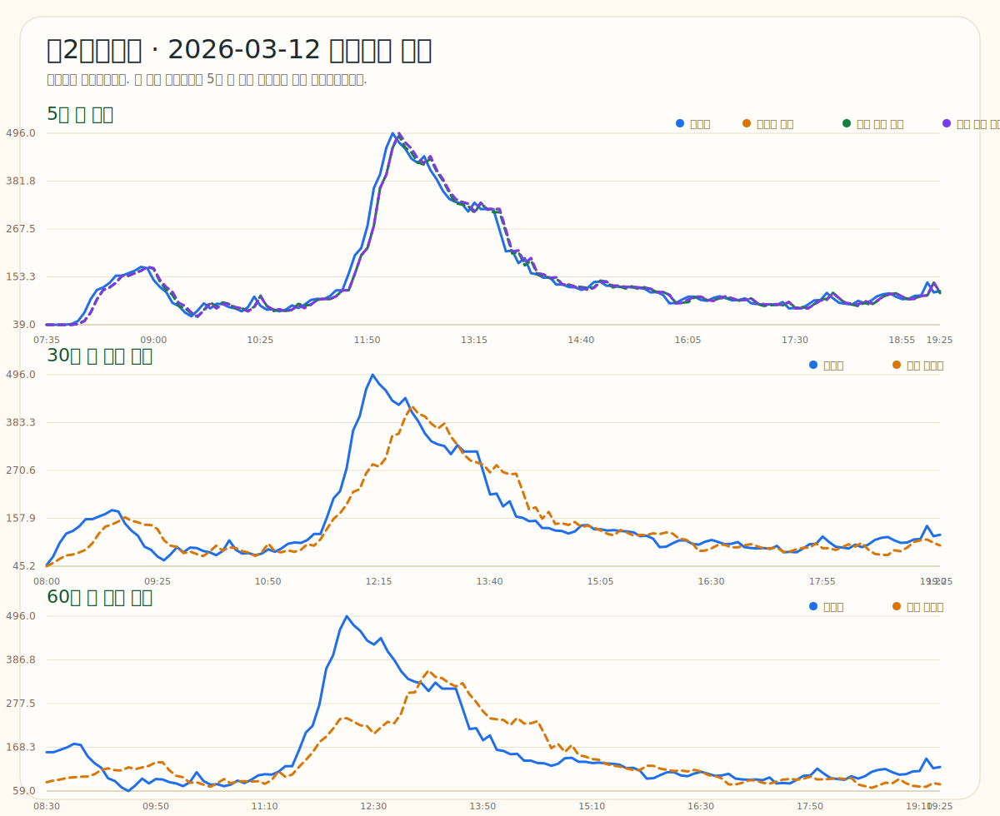
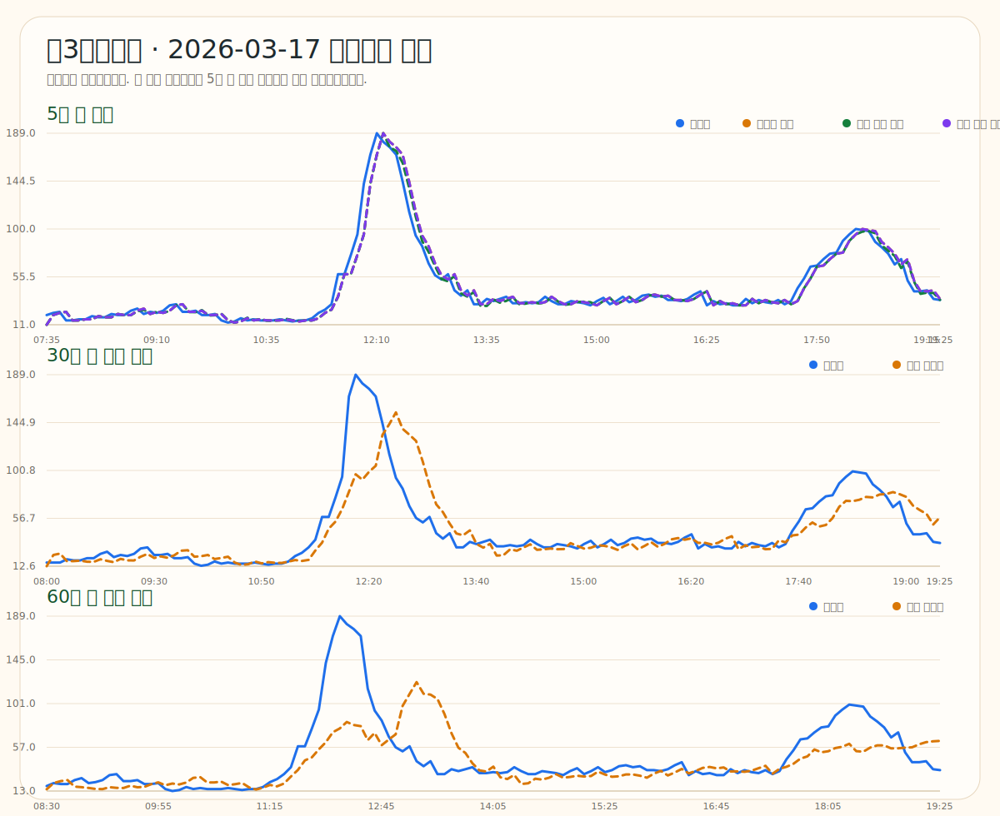
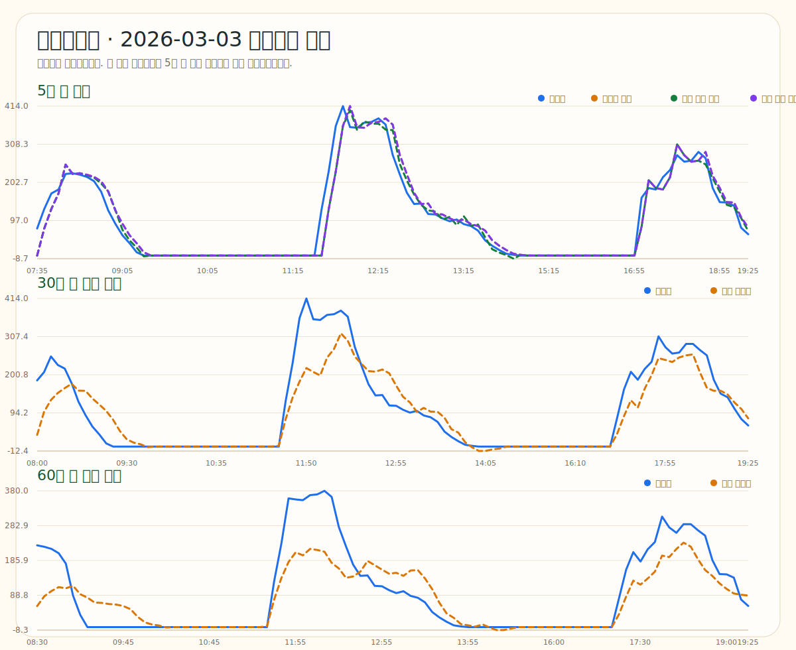

# 2025년 기준 설정, 2026년 검증 보고서

작성일: 2026-04-04  
학습 기준: 2025-01-01 ~ 2025-12-31  
검증 구간: 2026-01-01 ~ 2026-03-27  
검증 방식: 2025년까지의 패턴으로 규칙과 파라미터를 정한 뒤, 2026년 데이터에 대해 실제값과 비교하였습니다.  

## 1. 먼저 질문에 대한 답

질문하신 내용이 맞습니다. `5분 후는 지금 값 그대로 본다`는 방식은 피크 이후 하락 구간에서 늦게 반응할 수 있습니다. 그래서 이번에는 `피크 이후 하락 보정`, `같은 메인메뉴 기반 보정`, `식당별 다른 규칙`을 2025년 데이터로 먼저 정하고, 2026년 데이터에 대해 다시 검증하였습니다. 또한 이전처럼 날짜별 평균이나 최대만 보지 않고, 특정 날짜의 시간대별 그래프도 같이 만들었습니다.

### 구간별 조건부 판단 방향

이번 결과를 기준으로 보면, 전 구간에 하나의 규칙을 똑같이 적용하는 것보다 `구간 상태를 먼저 판단하고`, 그 상태에 맞는 규칙을 적용하는 방식이 더 적절합니다.

| 구간 | 더 강하게 볼 조건 | 적용 방향 |
|---|---|---|
| 상승 구간 | 최근 10~15분 동안 계속 증가하는지, 아직 평소 피크 시간 이전인지 | 현재값 비중을 높게 유지 |
| 피크 직후 하락 구간 | 평소 피크 시간을 지났는지, 직전 몇 슬롯이 이미 꺾였는지 | 현재값을 그대로 복사하지 않고 평소값 쪽으로 조금 당김 |
| 안정 구간 | 변화 폭이 작고 현재값이 평소값 근처인지 | 가장 단순한 규칙 유지 |
| 특수일 구간 | 학사 행사, 시험기간, 특정 고정 메뉴일인지 | 별도 플래그나 예외 규칙 후보로 관리 |

즉, 이번 보고서의 방향은 `전 구간 공통 규칙`보다는 `구간별 조건부 규칙` 쪽에 더 가깝습니다.

## 2. 5분 후 예측에서 어떤 후보를 비교했는가

| 후보 방식 | 설명 | 2026년 전체 MAE | 실제로 감소한 구간 MAE | 메뉴 후보 적용 가능 비율 | 판단 |
|---|---|---:|---:|---:|---|
| 현재값 유지 | 현재 관측값을 그대로 다음 5분 값으로 사용 | 3.6 | 5.9 | - | 기본 기준 |
| 요일 피크 이후 보정 | 평소 피크 시간이 지난 뒤에는 현재값을 조금 덜 믿고 평소값 쪽으로 당김 | 3.9 | 5.2 | - | 보조 후보 |
| 메인메뉴 피크 보정 | 같은 메인메뉴 이력이 충분할 때만 메뉴별 피크 시간을 사용 | 3.6 | 5.6 | 7.4% | 탈락 |
| 메인메뉴 평균값 | 같은 메인메뉴의 같은 시간대 평균값을 바로 사용 | 29.3 | 35.7 | 7.3% | 탈락 |

### 왜 이런 결론이 나왔는가

- `현재값 유지`는 전체 구간 기준으로 가장 안정적이었습니다.
- `요일 피크 이후 보정`은 하락 구간만 떼어 보면 일부 도움이 되었지만, 피크 직전 상승 구간을 너무 일찍 눌러 전체 성능에서는 기본 규칙을 뒤집지 못했습니다.
- `메인메뉴 피크 보정`은 생각 자체는 좋았지만, 같은 메인메뉴가 충분히 반복된 경우가 제한적이었습니다. 그래서 적용 가능한 구간이 많지 않았고, 적용되더라도 식당마다 효과가 일정하지 않았습니다.
- `메인메뉴 평균값`은 특정 메뉴를 너무 강하게 믿는 방식이라, 실제 당일 흐름과 어긋날 때 오차가 커졌습니다.
- 참고로 메인메뉴 피크 보정은 적용 가능한 구간만 따로 보면 MAE가 10.9명으로, 기본 규칙보다 더 좋지 않았습니다.
- 메인메뉴 평균값은 적용 가능한 구간만 따로 봐도 MAE가 91.1명으로 매우 크게 벌어졌습니다.

## 3. 최종 채택한 식당별 규칙

| 식당 | 5분 후 | 30분 후 | 60분 후 | 2026년 30분 MAE | 2026년 60분 MAE |
|---|---|---|---|---:|---:|
| 상록회관 | 지금 흐름 그대로 | 30분 뒤 평소값 + 현재 차이 100.0% | 60분 뒤 평소값 + 현재 차이 90.0% | 6.8 | 9.7 |
| 생활과학대 | 지금 흐름 그대로 | 30분 뒤에도 지금 값 그대로 | 60분 뒤에도 지금 값 그대로 | 0.7 | 1.0 |
| 제1학생회관 | 지금 흐름 그대로 | 30분 뒤 평소값 + 현재 차이 90.0% | 60분 뒤 평소값 + 현재 차이 80.0% | 22.5 | 33.8 |
| 제2학생회관 | 지금 흐름 그대로 | 30분 뒤 평소값 + 현재 차이 90.0% | 60분 뒤 평소값 + 현재 차이 80.0% | 13.1 | 17.3 |
| 제3학생회관 | 지금 흐름 그대로 | 30분 뒤 평소값 + 현재 차이 90.0% | 60분 뒤 평소값 + 현재 차이 80.0% | 5.9 | 8.1 |
| 학생생활관 | 지금 흐름 그대로 | 30분 뒤 평소값 + 현재 차이 60.0% | 60분 뒤 평소값 + 현재 차이 40.0% | 21.5 | 30.5 |

## 4. 시간대별 실제값과 예측값 비교

이전 보고서의 날짜별 평균/최대 그래프만으로는 특정 시간대를 얼마나 맞췄는지 보기 어려웠습니다. 아래 그래프는 2026년 검증 구간 중 각 식당에서 가장 피크가 컸던 대표 날짜를 골라, 시간대별 실제값과 예측값을 직접 비교한 것입니다. 첫 번째 패널은 5분 후 비교이며, 여기에는 `현재값 유지`, `요일 피크 이후 보정`, `메인메뉴 피크 보정`을 함께 넣었습니다.

### 상록회관 대표 날짜: 2026-03-18

### 생활과학대 대표 날짜: 2026-01-09

### 제1학생회관 대표 날짜: 2026-03-10

### 제2학생회관 대표 날짜: 2026-03-12

### 제3학생회관 대표 날짜: 2026-03-17

### 학생생활관 대표 날짜: 2026-03-03

## 5. 왜 5분 후 그래프에서 실제값 선이 잘 안 보였는가

이전 그래프는 날짜별 평균값과 최대값을 기준으로 그렸기 때문에, `5분 후 실제값`과 `5분 후 예측값`이 거의 겹쳐 보이거나 완전히 포개지는 경우가 많았습니다. 그래서 실제 선이 없는 것처럼 보였습니다. 이번 보고서는 특정 날짜의 시간대별 실제값과 예측값을 직접 겹쳐서 보여주므로, 어느 시간대에서 따라가고 어느 시간대에서 늦게 반응하는지 바로 확인하실 수 있습니다.

## 6. 함께 보시면 좋은 파일

- [시간대별 그래프 폴더](./congestion-2026-time-graphs)
- [검증 요약 CSV](./congestion-2026-validation-summary.csv)
- [분석 코드](/D:/SeeAndYouGo-2/backend/tools/Congestion2026ValidationBundle.java)

<small>참고 메모: 복날처럼 메뉴가 거의 고정되는 특수일은 향후 별도 이벤트 플래그나 예외 규칙으로 고려할 수 있습니다. 이 부분은 추후 추가 논의가 필요합니다.</small>
